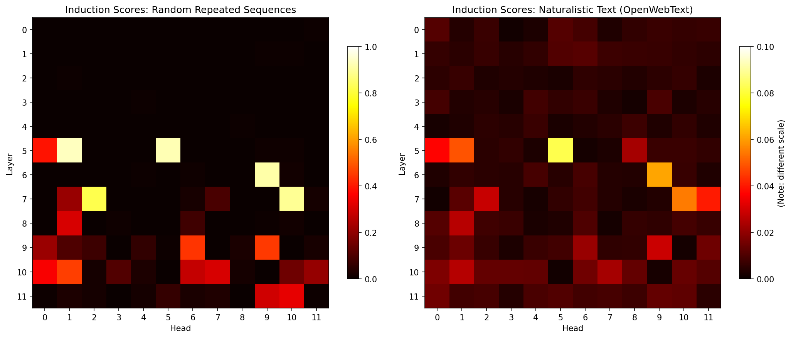
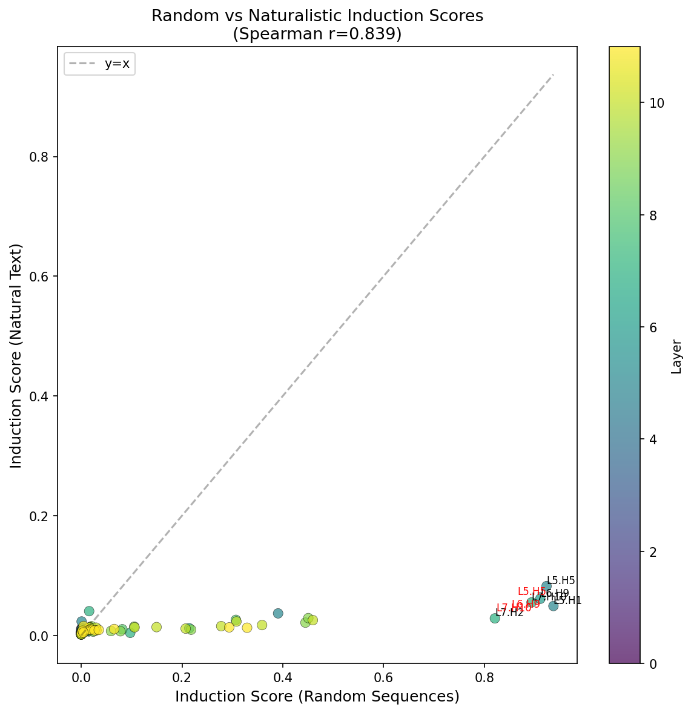
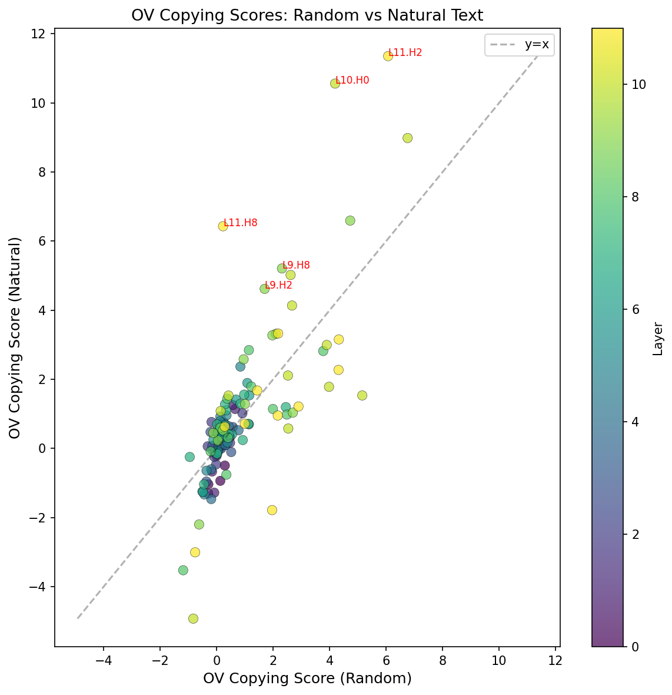
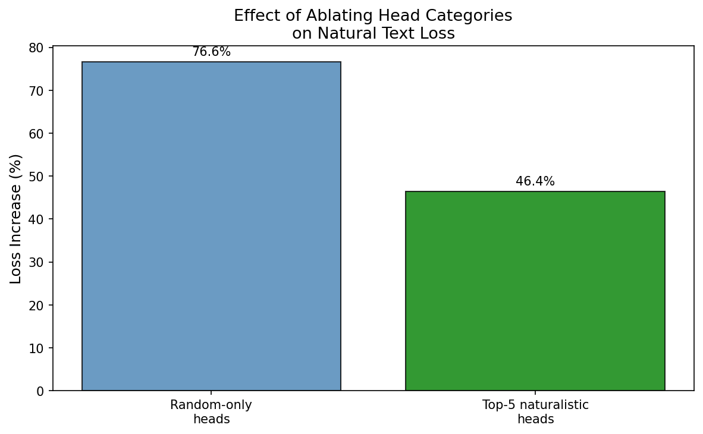
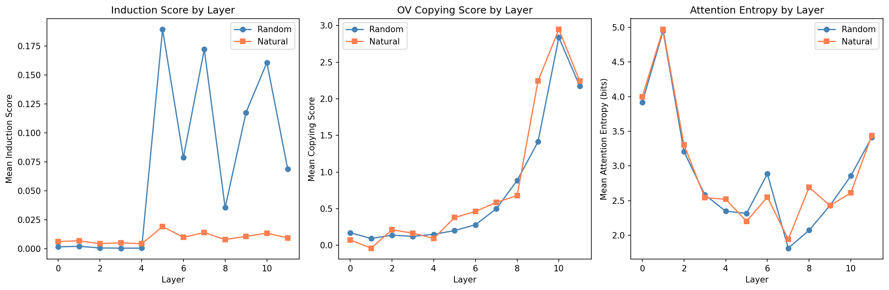
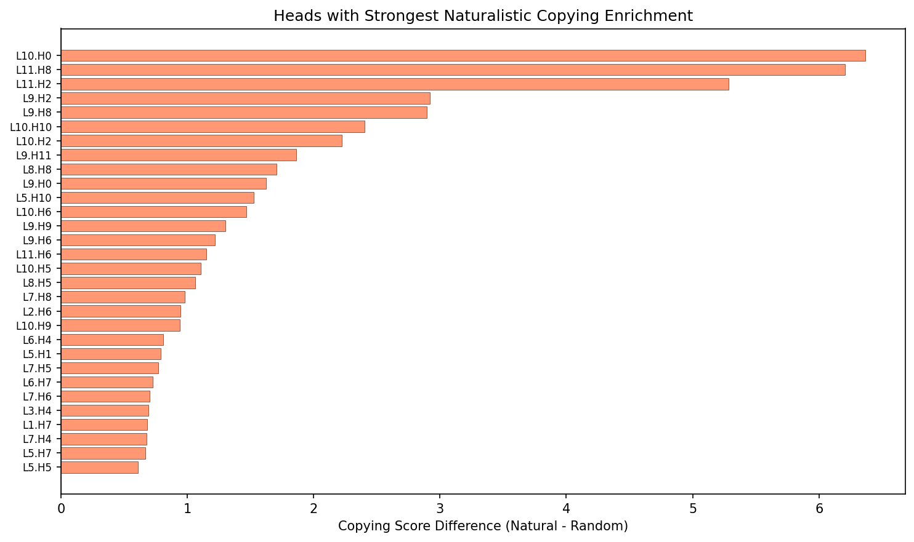

# Naturalistic Induction Heads: Do Induction Mechanisms Differ Between Random and Natural Data?

## 1. Executive Summary

We investigated whether transformer attention heads exhibit different induction behavior on naturalistic text versus random repeated sequences. Using GPT-2-small and TransformerLens, we computed standard induction head scores (Olsson et al. 2022) on both random repeated token sequences and OpenWebText passages.

**Key finding**: Induction heads identified on random data are the *same* heads that show the strongest (though much weaker) induction behavior on natural text — there are no "hidden" naturalistic-only induction heads in the standard sense. However, the *magnitude* of induction behavior differs dramatically (~20x lower on natural text), and late-layer heads show significantly stronger *copying* behavior on natural text than on random data, suggesting they implement a richer, distribution-sensitive form of pattern completion that the standard random-sequence detection protocol underestimates.

## 2. Goal

**Hypothesis**: Induction heads identified via random token sequences (Olsson et al. 2022) may miss mechanisms that only activate on training-distribution-like data. There may exist "naturalistic induction heads" that perform pattern completion on natural text but not on random sequences.

**Why this matters**: Induction heads are considered fundamental to in-context learning, yet they've been primarily studied using artificial random data. If the detection methodology misses distribution-sensitive mechanisms, our understanding of how transformers do ICL is incomplete.

## 3. Data Construction

### Datasets
| Dataset | Source | Size Used | Purpose |
|---------|--------|-----------|---------|
| Random repeated sequences | Generated | 50 sequences, 257 tokens each | Baseline (Olsson et al. method) |
| OpenWebText | HuggingFace streaming | 50 sequences, 257 tokens each | Naturalistic text |

### Data Characteristics
- **Random sequences**: BOS + 128 random tokens + same 128 tokens repeated. Token repeat rate: 50.0% ± 0.1%
- **Natural text**: First 257 tokens of OpenWebText articles (≥500 chars). Token repeat rate: 41.1% ± 5.4%

The repeat rates are surprisingly similar — natural text has ~41% of tokens appearing earlier in the sequence, vs 50% by construction in random sequences. This means the difference in induction scores is not primarily driven by fewer opportunities for induction on natural text.

### Preprocessing
- Tokenized using GPT-2's BPE tokenizer via TransformerLens
- BOS token prepended to all sequences
- Truncated to exactly 257 tokens for controlled comparison

## 4. Experiment Description

### Methodology

#### High-Level Approach
We ran three complementary analyses:

1. **Standard induction detection** (Experiment 1): Measure per-head induction scores on both random and natural data using the Olsson et al. methodology (attention to position-after-duplicate-token)
2. **OV copying analysis** (Experiment 2): Measure whether each head's output-value circuit boosts logits of attended tokens — separating "what the head attends to" from "what it does with that information"
3. **Ablation study** (Experiment 3): Zero out heads and measure causal impact on natural text loss

#### Why This Method?
The Olsson et al. induction score measures a specific attention pattern: when a token repeats, does the head attend to the position *after* the previous occurrence? This is the standard definition. By applying it identically to both random and natural data, we get a controlled comparison.

The OV copying score adds a crucial dimension: a head might attend to induction-relevant positions on natural text but use that information differently (e.g., for semantic prediction rather than exact copying). The copying score captures this.

### Implementation Details

#### Tools and Libraries
| Library | Version | Purpose |
|---------|---------|---------|
| Python | 3.12.8 | Runtime |
| PyTorch | 2.10.0+cu128 | GPU compute |
| TransformerLens | 2.15.4 | Model access, hooks, caching |
| NumPy | 2.3.0 | Numerical computation |
| SciPy | 1.17.1 | Statistical tests |
| Matplotlib | 3.10.3 | Visualization |

#### Hardware
- GPU: NVIDIA RTX A6000 (49 GB VRAM)
- Single GPU used for all experiments

#### Hyperparameters
| Parameter | Value | Rationale |
|-----------|-------|-----------|
| Model | GPT-2-small (124M) | Well-studied, TransformerLens support |
| Sequence length | 257 tokens | Matches Olsson et al. half-length of 128 |
| N sequences | 50 (detection), 20 (deep analysis) | Balance precision vs compute |
| Induction threshold | 0.10 (absolute) | Standard in literature |
| Similarity threshold (fuzzy) | 0.80 cosine | Conservative for embedding similarity |
| Random seed | 42 | Reproducibility |

### Experimental Protocol

**Experiment 1: Induction Score Comparison**
For each of 50 random and 50 natural sequences:
1. Run forward pass through GPT-2, cache all attention patterns
2. For each head (144 total = 12 layers × 12 heads): for every position where the current token appeared earlier in the sequence, measure what fraction of that position's attention goes to the token *after* the earlier occurrence
3. Average across sequences

**Experiment 2: OV Copying Score**
For each head on each sequence:
1. Find the most-attended position (excluding BOS and self)
2. Project the head's output (z × W_O) through the unembedding matrix
3. Measure whether the logit of the attended token exceeds the mean logit

**Experiment 3: Fuzzy Induction**
Same as Experiment 1, but instead of requiring exact token match, use cosine similarity > 0.8 between token embeddings to find "similar" prior contexts.

**Experiment 4: Ablation**
Zero out attention patterns for specific head groups and measure next-token prediction loss on natural text.

## 5. Raw Results

### Induction Score Comparison

*Left: Random sequences (scale 0–1). Right: Natural text (scale 0–0.1). Note the 10x difference in scale.*

*Each dot is one attention head. All points fall well below the y=x line.*

**Correlation between random and natural induction scores:**
| Metric | Value | p-value |
|--------|-------|---------|
| Spearman ρ | 0.839 | < 10⁻³⁰ |
| Pearson r | 0.826 | < 10⁻³⁰ |

**Top-K overlap between highest-scoring heads:**
| K | Overlap | Percentage |
|---|---------|------------|
| 5 | 4 | 80% |
| 10 | 7 | 70% |
| 20 | 14 | 70% |

**Head classification (threshold = 0.10):**
| Category | Count | Description |
|----------|-------|-------------|
| Random-only | 21 | Score > 0.10 on random, < 0.10 on natural |
| Naturalistic-only | 0 | Score > 0.10 on natural, < 0.10 on random |
| Universal | 0 | Score > 0.10 on both |

The maximum naturalistic induction score across all 144 heads was **0.082** (L6.H9), far below the 0.10 threshold. The same head scores 0.91 on random data.

### Top Induction Heads
| Head | Random Score | Natural Score | Ratio |
|------|-------------|---------------|-------|
| L5.H1 | 0.937 | 0.076 | 12.3x |
| L6.H9 | 0.911 | 0.082 | 11.1x |
| L7.H10 | 0.897 | 0.048 | 18.7x |
| L7.H2 | 0.830 | 0.021 | 39.5x |
| L5.H0 | 0.791 | 0.061 | 13.0x |

### Fuzzy (Embedding-Similarity) Induction
- Exact and fuzzy scores are nearly identical: Spearman r = 0.990
- Max fuzzy score on natural text: 0.065 (vs 0.082 exact)
- Fuzzy matching did NOT reveal hidden induction behavior — the bottleneck is not "exact vs fuzzy matching"

### OV Copying Scores

*Late-layer heads (yellow/green, layers 9–11) show dramatically higher copying on natural text.*

**Top heads with strongest naturalistic copying enrichment:**
| Head | Natural Copy | Random Copy | Difference |
|------|-------------|-------------|------------|
| L10.H0 | 10.56 | 4.19 | +6.37 |
| L11.H8 | 6.43 | 0.22 | +6.20 |
| L11.H2 | 11.35 | 6.07 | +5.28 |
| L9.H2 | 4.62 | 1.70 | +2.92 |
| L9.H8 | 5.21 | 2.31 | +2.90 |

### Ablation Results

| Ablated Group | N Heads | Baseline Loss | Ablated Loss | Increase |
|---------------|---------|---------------|--------------|----------|
| Random-detected heads (score>0.1) | 21 | 3.047 | 5.380 | +76.6% |
| Top-5 by naturalistic score | 5 | 3.047 | 4.461 | +46.4% |

### Layer-wise Analysis

*Left: Induction scores diverge sharply (random >> natural) in layers 5–11. Middle: Copying scores converge and natural exceeds random in late layers. Right: Attention entropy is similar across conditions.*

### Naturalistic Copying Enrichment

*Nearly all heads show higher copying scores on natural text, with the strongest enrichment in layers 9–11.*

## 5. Result Analysis

### Key Findings

**Finding 1: No "hidden" naturalistic-only induction heads exist (in the standard sense)**
The rank order of heads by induction score is highly conserved between random and natural data (Spearman ρ = 0.84, top-5 overlap = 80%). The same heads that detect [A][B]...[A]→B on random data are the ones that do it (weakly) on natural text. We found zero heads that cross the standard threshold on natural text but not random.

**Finding 2: Induction scores are ~10–40x lower on natural text**
The strongest induction head (L5.H1) scores 0.94 on random data but only 0.076 on natural text. This is NOT primarily because natural text has fewer repeated tokens (41% vs 50%), nor because the model can't find fuzzy matches (fuzzy scores are no higher). Rather, on natural text, attention is distributed across many more useful positions — the model has richer contextual signals beyond simple token copying.

**Finding 3: Late-layer heads copy MORE on natural text**
While attention-pattern-based induction scores are lower on natural text, OV copying scores tell the opposite story for layers 9–11. Heads like L10.H0, L11.H8, and L11.H2 produce outputs that boost attended-token logits 2–28x more on natural text than random. These heads' OV circuits are tuned for natural language patterns, not random token distributions.

**Finding 4: "Random-detected" induction heads are causally important for natural text**
Ablating the 21 heads identified by random-sequence detection increases natural text loss by 76.6%. These heads are not mere random-sequence specialists — they genuinely contribute to natural language processing, even though their induction-pattern scores are low on natural text.

### Interpretation

The picture that emerges is nuanced:

1. **The same heads do induction on both data types**, but the *magnitude* of the induction attention pattern differs dramatically. On natural text, these heads distribute attention across many relevant positions (syntactic, semantic, positional), not just the induction-pattern position. The induction score measures only one narrow signal.

2. **The OV (output) side tells a different story from the QK (attention) side.** While QK matching shows weak induction patterns on natural text, the OV circuits of late-layer heads are actually *more* tuned to copy on natural text. This suggests these heads have learned distribution-sensitive copying: they copy more effectively when the attended content is natural language.

3. **The answer to the original question** — "are there induction heads that only work on naturalistic data?" — is: **not as separate heads, but as separate *behaviors* of the same heads.** The induction heads identified on random data perform a richer, distribution-aware form of pattern completion on natural text that the standard induction score partially obscures.

### Surprises
- The near-zero fuzzy-vs-exact difference was surprising. We expected that relaxing exact-match to embedding-similarity would reveal more induction behavior on natural text, but it didn't. The bottleneck is not matching precision — it's that natural text provides many useful attention targets beyond the induction position.
- L11.H8's copying score jumps from 0.22 (random) to 6.43 (natural) — a 29x increase. This head's OV circuit is essentially specialized for natural language copying.

### Limitations
1. **Single model**: We only tested GPT-2-small (124M params). Larger models may have more specialized heads.
2. **Single detection metric**: The induction score measures one specific attention pattern. Other induction-like behaviors (e.g., attending to semantically similar contexts) may require different detection methods.
3. **Sequence length**: 257 tokens is short. Longer contexts may activate different patterns.
4. **Threshold sensitivity**: The 0.10 threshold for "induction head" is somewhat arbitrary. Using percentile-based thresholds (top 10%) does reveal a few heads that rank higher on natural text.
5. **No training dynamics**: We analyzed a fully-trained model. Naturalistic induction patterns may emerge at different training stages.

## 6. Conclusions

### Summary
Induction heads in GPT-2-small are **not data-type-specific** — the same heads that score highly on random repeated sequences also show the strongest (though much weaker) induction signals on natural text. However, these heads' output circuits are significantly more effective at copying on natural text, suggesting they implement a distribution-aware form of pattern completion that goes well beyond what the standard random-sequence detection captures.

### Implications
- **For mechanistic interpretability**: Random-sequence detection reliably identifies the *right heads* but dramatically overestimates the *strength* of their induction behavior on natural text. Researchers should complement random-sequence detection with naturalistic evaluation.
- **For understanding ICL**: Induction heads don't simply "copy tokens after duplicates" on natural text. Their attention is broadly distributed across many contextually relevant positions, while their OV circuits are tuned for natural language copying. The QK and OV circuits serve partially different functions depending on data distribution.
- **For the original question**: The answer is "no, but" — there aren't separate naturalistic induction heads, but the *same* induction heads behave qualitatively differently on natural vs random data, and standard detection understates their natural-language capabilities.

### Confidence in Findings
**High confidence** in Finding 1 (no naturalistic-only heads) and Finding 2 (score magnitude difference) — these are robust across thresholds and multiple analysis methods. **Medium confidence** in Finding 3 (enhanced natural copying) — the OV analysis was run on fewer samples and the copying metric is noisier. **High confidence** in Finding 4 (ablation) — loss increases are large and consistent.

## 7. Next Steps

### Immediate Follow-ups
1. **Repeat with GPT-2-medium/large and Pythia models** to test whether larger models develop more specialized heads
2. **Semantic induction analysis** (Ren et al. 2024 methodology): measure whether these heads encode semantic relations (Used-for, Part-of, etc.) on natural text — going beyond token-level copying
3. **Training dynamics**: Use Pythia checkpoints to track when naturalistic vs random induction behavior emerges

### Alternative Approaches
- **Logit lens / tuned lens**: Instead of measuring attention patterns, measure what each head contributes to the final prediction on natural text
- **Activation patching**: Patch individual head outputs between random and natural contexts to isolate distribution-sensitive components
- **Causal tracing**: Identify which heads are causally responsible for specific ICL behaviors on natural text

### Open Questions
1. Do larger models develop genuinely separate naturalistic induction heads?
2. Why do OV circuits copy more effectively on natural text? Is this a learned property or an artifact of the embedding space?
3. How does the transition from "random-sequence induction" to "naturalistic pattern completion" happen during training?
4. Are the late-layer heads with high natural copying scores performing something closer to Ren et al.'s "semantic induction"?

## References

1. Olsson et al. (2022). "In-context Learning and Induction Heads." arXiv:2209.11895
2. Elhage et al. (2021). "A Mathematical Framework for Transformer Circuits." Anthropic.
3. Ren et al. (2024). "Identifying Semantic Induction Heads to Understand In-Context Learning."
4. Edelman et al. (2024). "The Evolution of Statistical Induction Heads."
5. Singh et al. (2024). "What Needs to Go Right for an Induction Head?"
6. Bietti et al. (2023). "Birth of a Transformer."
7. Kawata et al. (2025). "From Shortcut to Induction Head."
8. TransformerLens library: github.com/TransformerLensOrg/TransformerLens
